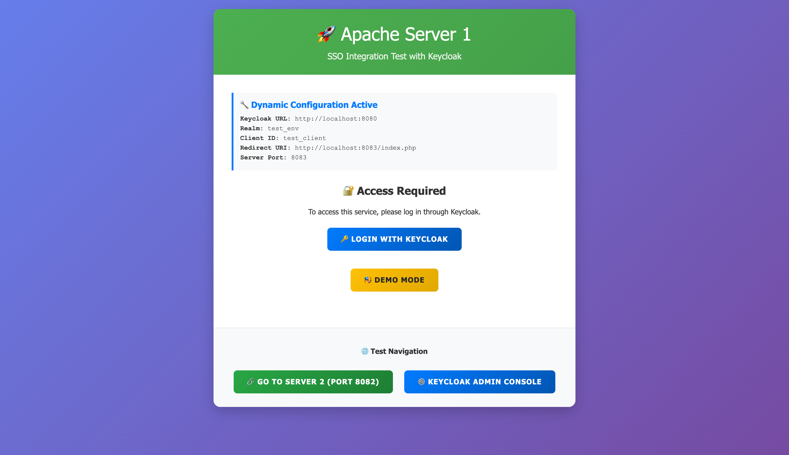
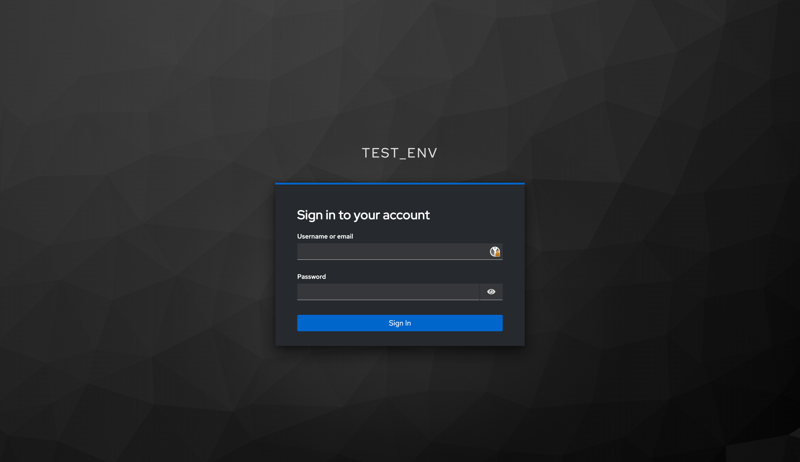
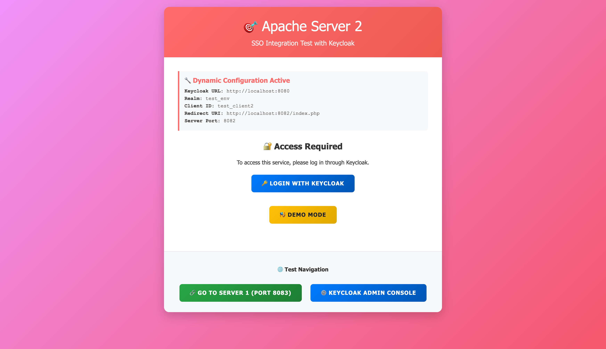
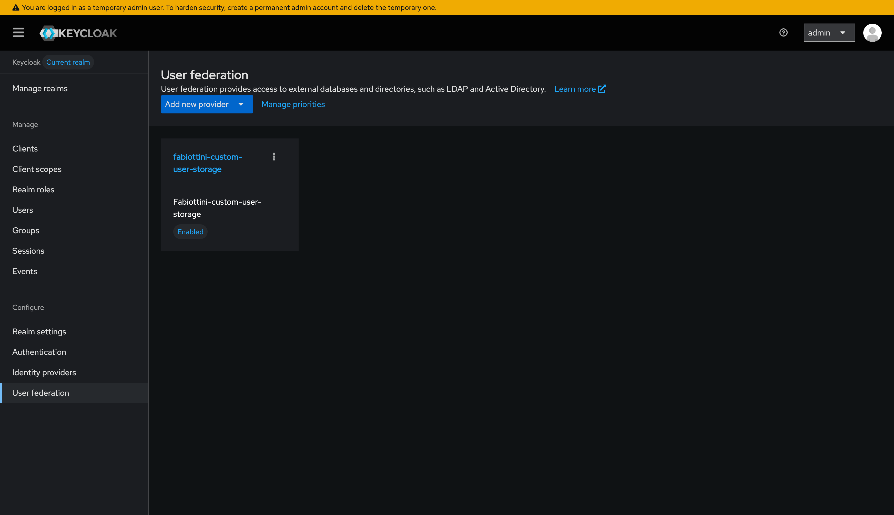
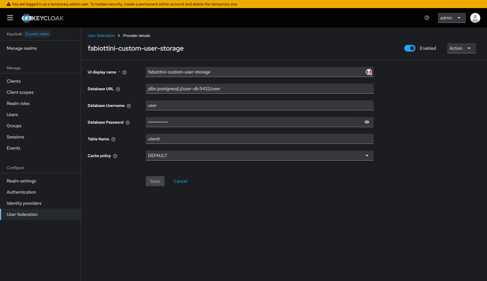

# Keycloak Custom User Storage SPI

> **PROOF OF CONCEPT PROJECT**
>
> This is an experimental proof-of-concept developed to investigate the feasibility of integrating legacy user databases with Keycloak SSO using a custom User Storage Provider. This project is not production-ready and serves as a technical exploration of authentication federation patterns.

## Visual Overview

This section provides visual examples of the application in action and the dynamic SPI configuration in Keycloak.

### Application Flow

The system provides two test Apache/PHP applications that demonstrate SSO authentication via Keycloak with the custom User Storage Provider.

**Application 1 - Login Flow:**


*Test Application 1 initial page with "Login with Keycloak" button*


*Keycloak authentication page - users authenticate with credentials from the custom database*


*Application 1 after successful authentication showing user details and JWT token information*

**Application 2 - SSO Experience:**


*Test Application 2 initial page*


*Application 2 demonstrating Single Sign-On - automatic authentication without re-entering credentials*

### Dynamic SPI Configuration

The custom User Storage Provider is dynamically configured in Keycloak's Admin Console without requiring code changes or redeployment.

**User Federation Configuration:**


*Keycloak User Federation page showing the fabiottini-custom-user-storage provider configuration*

**Dynamic Database Connection Parameters:**


*Dynamic configuration of database connection parameters (URL, credentials, table name) directly in Keycloak UI*

These parameters allow the SPI to connect to any PostgreSQL database without code modifications, making it flexible and reusable across different environments.

## Table of Contents

- [Visual Overview](#visual-overview)
- [Quick Start Guide](#quick-start-guide)
- [Overview](#overview)
- [Architecture](#architecture)
- [Technical Requirements](#technical-requirements)
- [Detailed Setup](#detailed-setup)
- [Configuration Management](#configuration-management)
- [Development Workflow](#development-workflow)
- [Testing](#testing)
- [Troubleshooting](#troubleshooting)
- [Security Considerations](#security-considerations)

## Quick Start Guide

This section provides a step-by-step guide to get the system up and running from scratch.

### Prerequisites

- Docker and Docker Compose installed
- Terminal/Command line access
- 8080, 8082, 8083, 8084, 5433 ports available

### Step 1: Clone and Configure

```bash
# Navigate to the project directory
cd keycloak-custom-user-spi

# Verify the .env file exists (it should be in the repository)
ls -la .env
```

### Step 2: Start All Services

```bash
# Start all Docker containers (Keycloak, PostgreSQL, Apache test apps)
make up

# This will start:
# - Keycloak (port 8080)
# - Custom User Database (port 5433)
# - Keycloak Database (internal)
# - Apache Test App 1 (port 8083)
# - Apache Test App 2 (port 8082)
# - Adminer DB Manager (port 8084)
```

**Wait approximately 30-60 seconds** for Keycloak to fully start.

### Step 3: Build and Deploy Custom SPI

```bash
# Build the custom User Storage Provider JAR
make build-spi

# This command:
# 1. Compiles the Java SPI using Maven in Docker
# 2. Copies the JAR to Keycloak's providers directory
# 3. Restarts Keycloak to load the provider
```

**Wait approximately 30 seconds** for Keycloak to restart.

### Step 4: Configure Keycloak

```bash
# Run the setup script to configure Keycloak
make setup-spi

# This will prompt you through:
# 1. Deploying the SPI JAR (confirm with Y)
# 2. Waiting for Keycloak to be ready
# 3. Creating the realm and OAuth clients
# 4. Removing any existing User Federation components (automatic)
# 5. Configuring User Federation with custom database
# 6. Synchronizing OAuth client secrets automatically

# Answer 'Y' to all prompts
# Note: Client secrets are automatically synchronized at the end
```

### Step 5: Verify Installation

```bash
# Check all service URLs and credentials
make show-urls

# Test the SPI integration
make test-spi
```

**Note**: OAuth client secrets are now synchronized automatically during `make setup-spi`. If you need to manually resync them later, use:
```bash
make update-client-secrets
```

### Step 6: Test Authentication

Open your browser and navigate to:

```
http://localhost:8082
```

**Test Credentials:**
- Username: `mrossi`
- Password: `mrossi`

Click **"Login with Keycloak"** and authenticate with the credentials above.

### Step 7: Verify Success

After successful authentication, you should see:
- User information (name, email, username)
- JWT token details
- Welcome message

### Alternative: One-Command Setup

For a completely automated setup from scratch:

```bash
make setup-from-scratch
```

This executes all steps automatically, but requires manual confirmation for the setup-spi step.

### Quick Reference: Service URLs

| Service | URL | Credentials |
|---------|-----|-------------|
| Apache Test App 1 | http://localhost:8083 | OAuth login |
| Apache Test App 2 | http://localhost:8082 | OAuth login |
| Keycloak Admin | http://localhost:8080/admin | admin / admin |
| Adminer (DB Tool) | http://localhost:8084 | See below |
| User Database | localhost:5433 | user / user_password / user |

**Adminer Connection Details:**
- **System**: PostgreSQL
- **Server**: user-db
- **Username**: user
- **Password**: user_password
- **Database**: user

### Available Test Users

The custom database includes these pre-configured users:

| Username | Password | Email |
|----------|----------|-------|
| mrossi | mrossi | mario.rossi@email.com |
| lverdi | lverdi | luigi.verdi@email.com |
| abianchi | abianchi | anna.bianchi@email.com |
| gneri | gneri | giulia.neri@email.com |
| mferrari | mferrari | marco.ferrari@email.com |
| sromano | sromano | sara.romano@email.com |
| aricci | aricci | andrea.ricci@email.com |
| emarino | emarino | elena.marino@email.com |
| dgreco | dgreco | davide.greco@email.com |
| fbruno | fbruno | francesca.bruno@email.com |

### Common Commands

```bash
# View all available commands
make help

# View service logs
make logs              # All services
make logs-keycloak     # Keycloak only
make logs-user-db      # Database only

# Service management
make restart           # Restart all services
make down              # Stop all services
make clean             # Stop and remove all containers

# Database operations
make db-show-users     # View all users in database
make db-shell          # Open PostgreSQL shell

# SPI development
make build-spi         # Rebuild and redeploy SPI
make test-spi          # Test SPI integration

# Check system status
make status            # Show all running containers
make show-urls         # Display all service URLs
```

### Troubleshooting Quick Start

**Keycloak not responding:**
```bash
# Check if Keycloak is running
docker ps | grep keycloak

# View Keycloak logs
make logs-keycloak
```

**Authentication fails with "Invalid credentials":**
```bash
# Verify user exists in database
make db-show-users

# Check if User Federation is configured
# Navigate to: http://localhost:8080/admin
# Go to: test_env realm > User Federation
# Verify "fabiottini-custom-user-storage" component exists and is enabled
```

**OAuth error "Invalid client credentials":**
```bash
# Resynchronize client secrets (normally done automatically by setup-spi)
make update-client-secrets

# Or run the complete setup again
make setup-spi
```

**Port already in use:**
```bash
# Check what's using the ports
lsof -i :8080
lsof -i :8082
lsof -i :8083

# Stop other services or modify ports in .env file
```

## Overview

This project demonstrates the implementation of a custom User Storage Provider (SPI) for Keycloak, enabling authentication against a legacy PostgreSQL database with MD5-hashed passwords. The architecture showcases how enterprise identity management systems can be extended to accommodate existing user repositories without requiring data migration or password re-hashing.

### Technical Context

Modern enterprises often face the challenge of integrating legacy authentication systems with contemporary identity providers. This POC explores:

- **Authentication Federation**: Delegating user authentication to external data sources while maintaining Keycloak's session management and OAuth2/OIDC capabilities
- **Custom SPI Implementation**: Extending Keycloak's modular architecture through the User Storage SPI
- **Legacy Database Integration**: Reading user credentials from custom database schemas without modifying the existing data model
- **Protocol Support**: Supporting both OAuth2 with OpenID Connect and SAML 2.0 authentication flows

### Research Goals

1. Validate the technical feasibility of custom user storage integration
2. Evaluate performance characteristics of external authentication providers
3. Understand the development and deployment lifecycle for Keycloak extensions
4. Document integration patterns for legacy system modernization

## Architecture

### Component Overview

```
┌──────────────────────────────────────────────────────────────┐
│                     Client Applications                      │
│                   (OAuth2/OIDC or SAML)                      │
└───────────────────────────┬──────────────────────────────────┘
                            │
┌───────────────────────────▼──────────────────────────────────┐
│                        Keycloak                              │
│  ┌─────────────────────────────────────────────────────┐     │
│  │        Custom User Storage Provider (SPI)           │     │
│  │  • User Lookup & Query                              │     │
│  │  • MD5 Credential Validation                        │     │
│  │  • User Attribute Mapping                           │     │
│  └──────────────────────┬──────────────────────────────┘     │
└─────────────────────────┼────────────────────────────────────┘
                          │
┌─────────────────────────▼───────────────────────────────────┐
│              Custom User Database (PostgreSQL)              │
│                   utenti table (MD5 passwords)              │
└─────────────────────────────────────────────────────────────┘
```

### Dual Database Design

The system maintains separation of concerns through two distinct databases:

**Keycloak Database**: Stores Keycloak's operational data including realm configurations, client registrations, sessions, and tokens.

**User Database**: Contains the legacy user repository with custom schema and MD5 password hashing. This database represents an existing authentication system being integrated with Keycloak.

### SPI Implementation Details

The Custom User Storage Provider implements Keycloak's `UserStorageProvider` interface, providing:

- **User Lookup**: Direct username-based queries against the custom database
- **Credential Validation**: MD5 hash computation and comparison for password verification
- **User Search**: Query capabilities for administration and user management interfaces
- **Read-Only Operations**: Focused on authentication without modifying the legacy database

**Key Implementation Files**:
- `CustomUserStorageProviderFactory`: Factory class for SPI registration (Provider ID: `fabiottini-custom-user-storage`)
- `CustomUserStorageProvider`: Core provider implementing authentication logic
- `CustomUserModel`: Adapter translating database records to Keycloak's UserModel interface

The SPI follows Java's Service Provider Interface pattern with registration via `META-INF/services/org.keycloak.storage.UserStorageProviderFactory`.

## Project Structure

```
keycloak-custom-user-spi/
├── custom-user-spi/                    # SPI source code
│   ├── src/main/java/
│   │   └── com/example/customspi/
│   │       ├── CustomUserStorageProviderFactory.java
│   │       ├── CustomUserStorageProvider.java
│   │       └── CustomUserModel.java
│   ├── src/main/resources/
│   │   └── META-INF/services/
│   │       └── org.keycloak.storage.UserStorageProviderFactory
│   ├── pom.xml                         # Maven configuration
│   └── target/                         # Build artifacts
├── docker/                             # Docker configurations
├── scripts/                            # Automation scripts
│   ├── config-loader.sh                # Centralized configuration management
│   ├── build-spi.sh                    # SPI compilation script
│   ├── setup-spi.sh                    # SPI deployment and configuration
│   ├── create_component.sh             # User Federation component creation
│   ├── remove_component.sh             # User Federation component removal
│   └── update-client-secrets.sh        # OAuth client synchronization
├── volumes/                            # Persistent data (excluded from git)
│   ├── apache1_html/                   # Test application 1
│   ├── apache2_html/                   # Test application 2
│   └── postgres_data/                  # Database persistence
├── docker-compose.yml                  # Service orchestration
├── Makefile                            # Build and deployment automation
└── user_db_schema_data.sql             # Database schema and test data
```

## Technical Requirements

- **Docker Engine**: 20.10+
- **Docker Compose**: 2.0+
- **Java Development Kit**: 21 (for local SPI development)
- **Maven**: 3.9+ (optional, Docker-based build available)

## Quick Start

### Initial Setup

```bash
# Start all services
make up

# Build and deploy custom SPI
make build-spi

# Configure SPI in Keycloak
make setup-spi

# Verify integration
make test-spi
```

### Complete Setup from Scratch

```bash
# Single command for full initialization
make setup-from-scratch
```

This command orchestrates:
1. Docker image building
2. Service initialization
3. SPI compilation and deployment
4. Keycloak configuration
5. OAuth client secret synchronization

## Configuration Management

All system parameters are centralized in the `.env` file, enabling environment-specific configuration without code modifications.

### Key Configuration Sections

**Keycloak**:
- `KEYCLOAK_HOST`, `KEYCLOAK_PORT`: Service endpoint
- `KEYCLOAK_ADMIN_USER`, `KEYCLOAK_ADMIN_PASSWORD`: Administrative credentials
- `KEYCLOAK_IMAGE`: Container image version

**Realm and OAuth Clients**:
- `REALM_NAME`: Keycloak realm identifier
- `CLIENT_ID`, `CLIENT_SECRET1`: OAuth2 client credentials
- `CLIENT_REDIRECT_URI1`, `CLIENT_REDIRECT_URI2`: Authorized redirect URIs

**User Database**:
- `DB_HOST`, `DB_PORT`, `DB_NAME`: Connection parameters
- `DB_USER`, `DB_PASSWORD`: Authentication credentials
- `DB_TABLE_NAME`: User table name

**Custom SPI**:
- `SPI_NAME`, `SPI_PROVIDER_ID`: Provider identification
- `SPI_JAR_NAME`: Artifact name
- `SPI_SOURCE_DIR`, `SPI_TARGET_DIR`: Build paths

**Adminer (Database Management)**:
- `ADMINER_PORT`: Web interface port (default: 8084)
- `ADMINER_CONTAINER_NAME`: Container name (default: adminer)
- `ADMINER_IMAGE`: Docker image (default: adminer:latest)
- `ADMINER_DEFAULT_SERVER`: Default database server (default: user-db)
- `ADMINER_DESIGN`: UI theme (default: nette)

### Configuration Validation

```bash
# Validate current configuration
make check-config

# Display configuration summary
make config
```

## Development Workflow

### SPI Development Cycle

```bash
# 1. Modify SPI source code
vim custom-user-spi/src/main/java/com/example/customspi/CustomUserStorageProvider.java

# 2. Build and deploy (automatic Keycloak restart)
make build-spi

# 3. Test changes
make test-spi

# 4. Review logs
make logs-keycloak
```

### Build System

The SPI compilation uses Maven within a Docker container, eliminating local JDK/Maven requirements:

```bash
docker run --rm \
  -v "$(pwd)/custom-user-spi:/workspace" \
  -w /workspace \
  maven:3.9-eclipse-temurin-21 \
  mvn clean package
```

Output artifact: `custom-user-spi/target/custom-user-spi-1.0.0.jar`

### Deployment Process

1. Maven builds the SPI JAR
2. Previous JAR removed from Keycloak container
3. New JAR copied to `/opt/keycloak/providers/`
4. Keycloak service restarted to load the updated provider

## Testing

### Service Endpoints

| Service | URL | Description |
|---------|-----|-------------|
| Keycloak Admin | http://localhost:8080/admin | Administration console |
| Apache App 1 | http://localhost:8083 | Test application (client 1) |
| Apache App 2 | http://localhost:8082 | Test application (client 2) |
| Adminer | http://localhost:8084 | Database management interface |
| User Database | localhost:5433 | PostgreSQL (internal access) |

### Test Users

The system includes pre-configured test users in the custom database:

| Username | Password | Email |
|----------|----------|-------|
| mrossi | mrossi | mario.rossi@email.com |
| lverdi | lverdi | luigi.verdi@email.com |
| abianchi | abianchi | anna.bianchi@email.com |
| gneri | gneri | giulia.neri@email.com |
| mferrari | mferrari | marco.ferrari@email.com |
| sromano | sromano | sara.romano@email.com |
| aricci | aricci | andrea.ricci@email.com |
| emarino | emarino | elena.marino@email.com |
| dgreco | dgreco | davide.greco@email.com |
| fbruno | fbruno | francesca.bruno@email.com |

Passwords are stored as MD5 hashes in the database.

### Integration Testing

**Browser-based Flow**:
```bash
# 1. Access test application
open http://localhost:8083

# 2. Click "Login con Keycloak"
# 3. Enter credentials: mrossi / mrossi
# 4. Verify successful authentication and user data display
```

**API-based Authentication**:
```bash
curl -X POST http://localhost:8080/realms/test_env/protocol/openid-connect/token \
  -H "Content-Type: application/x-www-form-urlencoded" \
  -d "grant_type=password" \
  -d "client_id=test_client2" \
  -d "username=mrossi" \
  -d "password=mrossi"
```

**Automated Integration Test**:
```bash
make test-spi
```

## Database Schema

```sql
CREATE TABLE utenti (
    id SERIAL PRIMARY KEY,
    nome VARCHAR(50) NOT NULL,
    cognome VARCHAR(50) NOT NULL,
    mail VARCHAR(100) NOT NULL UNIQUE,
    username VARCHAR(50) NOT NULL UNIQUE,
    password VARCHAR(32) NOT NULL  -- MD5 hash
);
```

### Database Management

**Web-based Management (Adminer)**:

Adminer provides a user-friendly web interface to inspect and manage both databases:

```bash
# Access Adminer at http://localhost:8084

# Login credentials:
# For Custom User Database:
#   System: PostgreSQL
#   Server: user-db
#   Username: user
#   Password: user_password
#   Database: user

# For Keycloak Database:
#   System: PostgreSQL
#   Server: keycloak-db
#   Username: keycloak
#   Password: keycloak_password
#   Database: keycloak
```

**Command Line Access**:

```bash
# View all users
make db-show-users

# Access PostgreSQL shell
make db-shell

# Reset database (WARNING: destroys data)
make db-reset
```

## Available Commands

### Service Management
```bash
make up              # Start all services
make down            # Stop all services
make restart         # Restart all services
make status          # Display service status
make clean           # Remove containers and volumes
```

### SPI Operations
```bash
make build-spi       # Build and deploy SPI
make setup-spi       # Configure SPI in Keycloak (auto-removes old component)
make remove-spi      # Remove User Federation component from Keycloak
make test-spi        # Run integration tests
```

### Development Tools
```bash
make logs            # View all service logs
make logs-keycloak   # Keycloak logs only
make logs-user-db    # Database logs only
make logs-apache1    # Apache container 1 logs
```

### Database Operations
```bash
make db-show-users   # Display user table contents
make db-shell        # Open psql interactive shell
make db-reset        # Reinitialize database schema
```

### Utilities
```bash
make show-urls       # Display all service endpoints
make config          # Show configuration summary
make check-config    # Validate configuration file
```

## Troubleshooting

### SPI Not Loading

**Diagnosis**:
```bash
# Check JAR deployment
docker exec keycloak ls -la /opt/keycloak/providers/

# Review Keycloak startup logs
docker logs keycloak | grep -i "fabiottini-custom-user-storage\|UserStorageProvider"

# Verify service registration file
cat custom-user-spi/src/main/resources/META-INF/services/org.keycloak.storage.UserStorageProviderFactory
```

**Solution**: Ensure the SPI factory class name in the service registration file matches the fully qualified class name.

### Database Connection Failures

**Diagnosis**:
```bash
# Test network connectivity
docker exec keycloak ping user-db

# Verify database accessibility
docker exec user-postgres psql -U user -d user -c "SELECT * FROM utenti;"

# Review SPI configuration
# Navigate to: Keycloak Admin > test_env realm > User Federation
```

**Solution**: Verify database connection parameters in the User Federation configuration match the values in `.env`.

### Authentication Failures

**Diagnosis**:
```bash
# Validate password hash
echo -n "mrossi" | md5sum

# Check user exists in database
docker exec user-postgres psql -U user -d user -c "SELECT username, mail FROM utenti WHERE username='mrossi';"

# Review authentication logs
docker logs keycloak | grep -i "authentication\|credential"
```

**Solution**: Ensure the User Federation provider is enabled in Keycloak and the user exists in the custom database.

## Security Considerations

### Current Implementation (POC)

- **MD5 Password Hashing**: Used for demonstration purposes only. MD5 is cryptographically broken and unsuitable for production use.
- **Plaintext Communication**: HTTP connections without TLS encryption.
- **Default Credentials**: Administrative passwords are simple and predictable.
- **Network Isolation**: Services communicate within Docker network without additional security layers.

### Production Recommendations

If adapting this POC for production environments:

1. **Strong Password Hashing**: Migrate to bcrypt, scrypt, or Argon2
2. **TLS/SSL**: Enable HTTPS for all communication
3. **Credential Management**: Use secrets management systems (HashiCorp Vault, AWS Secrets Manager)
4. **Database Security**: Implement connection encryption, restricted access, and audit logging
5. **Rate Limiting**: Add authentication attempt throttling
6. **Monitoring**: Implement security event logging and alerting
7. **Code Review**: Conduct security audit of SPI implementation

## Technical Insights

### JDBC Direct Access Pattern

The SPI uses direct JDBC connectivity without ORM abstraction:

```java
// Connection parameters from ComponentModel configuration
String dbUrl = model.getConfig().getFirst("dbUrl");
Connection conn = DriverManager.getConnection(dbUrl, dbUser, dbPassword);
```

Configuration values are injected via Keycloak's component model, set through the Admin Console or automated scripts.

### MD5 Credential Validation

Located in `CustomUserStorageProvider.java`:
```java
public boolean isValid(RealmModel realm, UserModel user, CredentialInput input) {
    // Computes MD5 digest of input password
    // Compares with stored hash from database
    // Returns boolean validation result
}
```

### User Attribute Mapping

`CustomUserModel` implements the adapter pattern, translating database columns to Keycloak's user model:

- `username` → `getUsername()`
- `mail` → `getEmail()`
- `nome` → `getFirstName()`
- `cognome` → `getLastName()`

## Version Information

- **Keycloak**: 26.3.1
- **PostgreSQL**: 15
- **Java**: 21
- **Maven**: 3.9
- **Docker Compose**: 2.0+

## Limitations

This proof-of-concept has intentional limitations:

1. **Read-Only Operations**: SPI does not support user creation, modification, or deletion
2. **No User Federation**: Does not implement user synchronization or caching
3. **Limited Attribute Mapping**: Only basic user attributes are exposed
4. **No Group/Role Management**: External group membership not supported
5. **Single Database Support**: Designed for one custom database connection
6. **Basic Error Handling**: Production-grade error recovery not implemented

## Future Research Directions

Potential extensions for further investigation:

- **Write Operations**: Implementing full CRUD operations through the SPI
- **User Caching**: Evaluating caching strategies for performance optimization
- **Advanced Attribute Mapping**: Custom user attributes and claims
- **Multiple Database Support**: Federation across multiple legacy systems
- **Performance Benchmarking**: Quantitative analysis of authentication latency
- **Migration Strategies**: Gradual migration from legacy to Keycloak-native user storage

## References

- [Keycloak Documentation](https://www.keycloak.org/documentation)
- [User Storage SPI Guide](https://www.keycloak.org/docs/latest/server_development/#_user-storage-spi)
- [OAuth 2.0 Specification](https://oauth.net/2/)
- [OpenID Connect Specification](https://openid.net/connect/)
- [SAML 2.0 Technical Overview](http://docs.oasis-open.org/security/saml/Post2.0/sstc-saml-tech-overview-2.0.html)

## License

See LICENSE file for details.

## Disclaimer

This project is a proof-of-concept for research and educational purposes. It is not intended for production use without significant security hardening and comprehensive testing. The implementation demonstrates technical feasibility but does not address all security, scalability, and operational requirements of production identity management systems.
